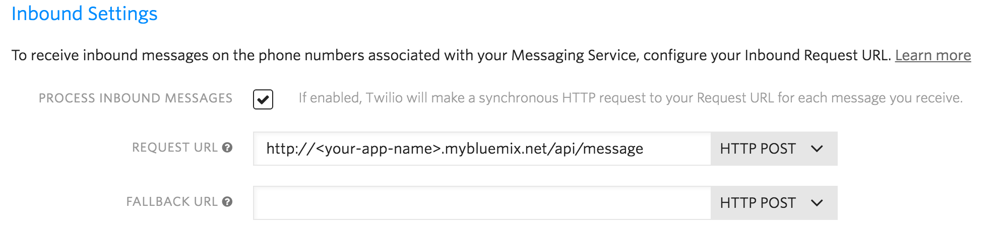

# Watson Services on Twilio Marketplace Demo App

A demo app that uses the `IBM Watson Message Insights` and the `IBM Watson Message Sentiment` add-ons for Twilio.

## Overview

TODO

This app demonstrates how quickly you can build an app on Bluemix using the Watson Add-ons for Twilio service.

## Application Requirements
You can use this app in any browser.

## Run the app on Bluemix
You can deploy your own instance of the demo app to Bluemix.

1. Create a Bluemix Account.

    [Sign up][bluemix_signup_url] for Bluemix, or use an existing account.

2. Download and install the [Cloud-foundry CLI][cloud_foundry_url] tool.

3. Clone the app to your local environment from your terminal using the following command:

  ```
  git clone https://github.com/cognitive-catalyst/twilio.git
  ```

4. `cd` into this newly created directory.

5. Install the required npm packages using the following command:

  ```
  npm install
  ```

6. Build your app with the following command:

  ```
  npm run build
  ```

7. Edit the `manifest.yml` file and change the `<name>` and `<host>` to something unique.

  ```
  applications:
  - name: watson-twilio-demo-app
     host: watson-twilio-demo-app
     buildpack: python_buildpack
     path: .
     domain: mybluemix.net
     instances: 1
     memory: 256M
  ```
  The host you use will determinate your application URL initially, for example, `<host>.mybluemix.net`.

8. Connect to Bluemix in the command line tool and follow the prompts to log in:

  ```
  $ cf api https://api.ng.bluemix.net
  $ cf login
  ```

9. First we need to create a MySQL Database instance. We will be using the ClearDB Spark Plan which is free and can hold up to 5 MB of data with 4 simultaneous connections. **Note**: You might need to target a space by selecting a space or by using the `cf target -s SPACE` command.

  ```
  $ cf create-service cleardb spark mysql-twilio-instance
  ```

10. Push the demo app to Bluemix. You need to perform additional steps when it is deployed, so you must add the option --no-start argument.

  ```
  $ cf push --no-start
  ```

11. Now, bind the service to your app. **Note**: The name *watson-twilio-demo-app* must be updated to reflect the name that you chose in step 5.

  ```
  $ cf bind-service watson-twilio-demo-app mysql-twilio-instance
  ```

12. Finally, start your app. You can also do this from the Bluemix dashboard. **Note**: The name *watson-twilio-demo-app* must be updated to reflect the name that you chose in step 5.

  ```
  $ cf start watson-twilio-demo-app
  ```

Congratulations! You now have your very own instance of the Insights for Weather demo app running on Bluemix. Try it out at `https://<host>.mybluemix.net`, where <host> is the value that you set in your `manifest.yml` file.

## Run the app locally

1. If don't have node.js already, [download node.js][download_node_url] and install it on your local machine.

2. Clone the app to your local environment from your terminal using the following command:

  ```
  git clone https://github.ibm.com/amblock/twilio.git
  ```

3. `cd` into this newly created directory.

4. Install the required npm packages using the following command:

  ```
  npm install
  ```

5. Build your app with the following command:

  ```
  npm run build
  ```

6. Set the mysql database credentials in the `config.json` file:

  ```
    {
        "credentials": {
            "name": "twilio",
            "hostname": <hostname>,
            "port": "3306",
            "username": <username>,
            "password": <password>
        }
    }
  ```

7. Run your app with the following command:

  ```
  python server.py
  ```

Now, go to `localhost:PORT` in your browser (for example, PORT is 8888 in the example above).

## Configure Twilio

1. [Create a Twilio Account](https://www.twilio.com/try-twilio)
2. Navigate to the [Programmable SMS services page](https://www.twilio.com/console/sms/services) and click on "Create new Messaging Service"
3. From the configure pane, put "http://\<your-app-name\>.mybluemix.net/api/message" as the Request Url 
4. Navigate to the numbers pane and Buy a Number
5. Add the IBM Watson Message Insights and the IBM Watson Message Sentiment Add-ons from the [Add-ons page](https://www.twilio.com/console/sms/add-ons)

## Contribute
We are happy to accept external contributions to this project, either in the form of issues or pull requests.
If you find a bug, please report it using the [Issues section](https://github.ibm.com/amblock/twilio/issues) or even better, fork the project and submit a pull request with your fix!
Pull requests will be evaluated on an individual basis based on value added to the sample application.

## Troubleshooting

The primary source of debugging information for your Bluemix app is the logs. To see them, run the following command using the Cloud Foundry CLI:

  ```
  $ cf logs <application-name> --recent
  ```
For more detailed information on troubleshooting your application, see the [Troubleshooting section](https://www.ng.bluemix.net/docs/troubleshoot/tr.html) in the Bluemix documentation.

### Useful links
[IBM Bluemix](https://bluemix.net/)  
[IBM  Bluemix Documentation](https://www.ng.bluemix.net/docs/)  
[IBM Bluemix Developers Community](http://developer.ibm.com/bluemix)  
[Twilio Marketplace](https://www.twilio.com/marketplace/add-ons)

[bluemix_signup_url]: https://console.ng.bluemix.net/registration/
[cloud_foundry_url]: https://github.com/cloudfoundry/cli
[download_node_url]: https://nodejs.org/download/
